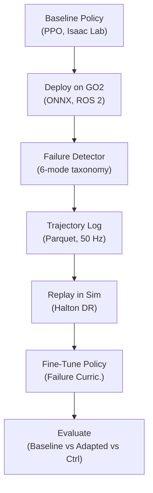

# Ashfall

[](LICENSE)

**Failure-driven robot learning for the Unitree GO2.**

Ashfall is a failure-driven policy adaptation system for quadruped locomotion. It detects hardware failures, extracts replayable failure segments, reconstructs them in simulation with controlled variation, and fine-tunes the locomotion policy to reduce repeated failures over time.

## The Ashfall Loop



## Failure Taxonomy

Ashfall classifies quadruped locomotion failures into 6 modes, ordered by severity:

| Mode | Sev. | Detection | Sim Replay Strategy |
|------|------|-----------|---------------------|
| Body Collapse | 5 | base_height < 0.15 m | Vary terrain + joint stiffness |
| Attitude Loss | 4 | \|pitch\| > 0.8 rad or \|roll\| > 0.6 rad | Sweep friction + push forces |
| Foot Slip | 3 | cmd > 0.3 m/s, actual < 0.05 m/s for 0.5 s | Low-friction terrain, sweep coeff. |
| Stumble | 2 | max \|joint_vel\| > 15 rad/s with feet in contact | Add terrain obstacles at swing height |
| Contact Loss | 2 | >= 2 feet below 5N for >= 0.1 s | Vary slope and surface irregularity |
| Command Mismatch | 1 | \|cmd - actual\| > 0.4 m/s for > 1.0 s | Sweep mass + actuator strength |

## Results (Simulation)

Status as of 2026-05-08: the failure-fraction curriculum at ff=0.5 does NOT reliably improve slippery success rate across seeds. n=7 paired mean is -1.10 pp with 95% CI crossing zero. The v0.2.0 +9.4 pp and v0.3.0 +5.1 pp slippery claims were both seed=42 artifacts that did not reproduce.

### 2026-05-08 seed-scaling pass (n=7, paired)

3 pilot seeds (42, 123, 7) plus 4 scaling seeds (99, 314, 1729, 2718) at ff in {0.0, 0.5} on Phoenix `audit-fixes-2026-04-16` + commit `d42ee01` (FailureCurriculum seed-propagation fix). 200-iter PPO fine-tune from rough baseline, 128-140 eval episodes per cell per terrain. 14 cells total, all rc=0.

| terrain  | ff=0.0 mean (SE) | ff=0.5 mean (SE) | paired mean delta | 95% paired CI       | per-seed signs | exact sign-flip p | clears alpha=0.05 |
|----------|------------------|------------------|-------------------|---------------------|----------------|-------------------|:------------------|
| slippery | 0.898 (0.011)    | 0.887 (0.012)    | -1.10 pp          | [-5.20, +3.01] pp   | 4 / 7 positive |            0.5625 | no                |
| rough    | 0.920 (0.016)    | 0.905 (0.013)    | -1.58 pp          | [-6.31, +3.15] pp   | 2 / 7 positive |            0.3906 | no                |

n=7 is structurally adequate (sign-flip floor 2/128 = 0.0156, so alpha=0.05 IS reachable at this sample size). Neither terrain comes close.

Honest verdict:
- **Slippery: no reliable effect.** 4/7 positive is roughly a coin flip. Per-seed deltas span +3.6 pp to -8.85 pp. The pilot's "3/3 positive" framing was a small-sample artifact.
- **Rough: regresses on average.** 2/7 positive, mean -1.58 pp. The curriculum trades rough proficiency for an unreliable slippery effect.

Full numbers: [`notes/2026-05-07-multiseed-scale-verdict.md`](notes/2026-05-07-multiseed-scale-verdict.md). Methodology: [`docs/methodology/2026-05-07-ff-sweep-rigor.md`](docs/methodology/2026-05-07-ff-sweep-rigor.md) section 5c.

### Earlier results (single-seed, kept for context)

The v0.2.0 baseline-vs-adapted comparison and the v0.3.0 6-cell `failure_fraction` sweep (single seed=42) reported +9.4 pp and +5.1 pp slippery lifts respectively. Neither replicates at n=7 paired analysis. The 2026-05-07 n=3 pilot looked directionally positive (3/3 seeds) but flipped under scaling. Details retained in `notes/2026-05-07-{sweep-verification,multiseed-verdict}.md` and methodology sections 5b and earlier for history.

### What's still salvageable

- The 6-mode failure taxonomy and detector are independently validated (18/18 synthetic parquets correctly classified, zero cross-fires, 2026-04-19) and remain a defensible contribution.
- The experiment + evaluation framework (sweep generator, paired analysis, sign-flip permutation tests, BCa bootstrap) is generally useful regardless of the curriculum result.
- The Phoenix FailureCurriculum seed-propagation patch (`d42ee01`) is a real fix that masked seed-driven variance in any prior curriculum-style ablation.

Three viable directions next: (1) re-design the curriculum (research pivot, not parameter sweep), (2) mode-subset ablation at ff=0.5 anyway with exploratory framing, (3) hardware data collection (synth failures may not generalize). See methodology section 5c for tradeoffs.

### Taxonomy validation (2026-04-19, no GPU)

The 6-mode `FailureDetector` was exercised against 18 synth parquets (6 modes × 3 variants) generated by `scripts/generate_failures.sh`. Every parquet's designed failure mode was correctly detected with zero cross-fires:

| mode | detected | cross-fires |
|---|---:|---:|
| attitude | 3 / 3 | 0 |
| collapse | 3 / 3 | 0 |
| slip | 3 / 3 | 0 |
| stumble | 3 / 3 | 0 |
| contact_loss | 3 / 3 | 0 |
| command_mismatch | 3 / 3 | 0 |

The ablation-sweep generator (`scripts/run_ablation.sh`) produces 6 `failure_fraction` cells (0.0, 0.1, 0.25, 0.5, 0.75, 1.0) with per-cell `commands.sh` stubs ready to execute inside Isaac Lab. The analysis pipeline (`scripts/analyze.sh`) consumes the results directory and writes `results/REPORT.md`: full tables + plots, with zero experiments populated until training runs land.

## Project Structure

```
ashfall/
  src/ashfall/
    taxonomy/          # 6-mode failure detector (pure numpy)
      detector.py      # Stateful multi-mode failure classifier
      schema.py        # Taxonomy metadata and table generation
    experiment/        # Experiment management
      schema.py        # Config/result dataclasses
      runner.py        # Pipeline orchestration (generates Isaac Lab commands)
      sweep.py         # Ablation sweep generation
    evaluation/        # Comparison framework
      harness.py       # Multi-condition comparison + bootstrap CI
      metrics.py       # Failure-specific metrics (recurrence, intervention)
    analysis/          # Post-hoc analysis
      plots.py         # Matplotlib visualizations
      tables.py        # Markdown table generation
      report.py        # Auto-generated experiment report
    synth/             # Synthetic failure generation
      generator.py     # Generates training data for all 6 failure modes
  configs/
    experiments/       # Named experiment configs (baseline, adapted, control, ablation)
    taxonomy.yaml      # Failure detection thresholds
  scripts/             # Shell scripts for reproducible runs
  data/failures/       # Failure trajectory Parquets (synthetic + hardware)
  results/             # Experiment outputs (metrics, plots, reports)
  tests/               # 113 unit tests
```

## Dependencies

Ashfall builds on [go2-phoenix](https://github.com/yusufdxb/go2-phoenix) for Isaac Lab simulation, PPO training, and sim-to-real export. Phoenix handles the sim/training/deployment side; Ashfall adds the experiment, evaluation, and adaptation orchestration layer.

| Component | Source |
|-----------|--------|
| Isaac Lab GO2 env | go2-phoenix `sim_env/` |
| PPO training | go2-phoenix `training/` (rsl_rl) |
| ONNX export | go2-phoenix `sim2real/` |
| ROS 2 deploy | go2-phoenix `sim2real/` |
| Failure detection | **Ashfall** `taxonomy/` (extends Phoenix's 3 modes to 6) |
| Trajectory logging | go2-phoenix `real_world/` |
| Replay + DR | go2-phoenix `replay/` |
| Failure curriculum | go2-phoenix `adaptation/` |
| Experiment management | **Ashfall** `experiment/` |
| Evaluation harness | **Ashfall** `evaluation/` |
| Analysis pipeline | **Ashfall** `analysis/` |
| Synthetic failures | **Ashfall** `synth/` |

## Quick Start

```bash
# Install
cd ~/Projects/ashfall
pip install -e ".[dev]"

# Run tests (no GPU required)
python3 -m pytest tests/ -v

# Generate synthetic failure data
./scripts/generate_failures.sh

# Prepare an experiment (generates Isaac Lab commands)
./scripts/run_experiment.sh configs/experiments/baseline.yaml

# Generate analysis report
./scripts/analyze.sh results/
```

### Running Experiments (requires Isaac Lab + GPU)

```bash
# Set environment
export ISAACLAB_PATH=$HOME/Sim/IsaacLab
export PHOENIX_ROOT=$HOME/workspace/go2-phoenix

# Train baseline (500 iters, ~28 min on RTX 5070)
./scripts/run_experiment.sh configs/experiments/baseline.yaml

# Train adapted policy (200 iters from baseline checkpoint)
./scripts/run_experiment.sh configs/experiments/adapted.yaml

# Run control condition
./scripts/run_experiment.sh configs/experiments/control_random.yaml

# Run ablation sweep
./scripts/run_ablation.sh configs/experiments/ablation_sweep.yaml

# Generate report
./scripts/analyze.sh
```

## Ablation Plan

| Axis | Values | Hypothesis |
|------|--------|------------|
| Failure fraction | 0.0, 0.1, 0.25, 0.5, 0.75, 1.0 | More failure data improves adaptation up to a point |
| Failure modes | single-mode vs all-mode | Multi-mode curriculum is more robust |
| Adaptation iters | 50, 100, 200, 400 | Diminishing returns past 200 iters |
| Domain randomization | narrow vs wide | Wider DR improves transfer but may hurt convergence |

## Evaluation Metrics

| Metric | Description |
|--------|-------------|
| Success rate | Episodes completing without early termination |
| Mean return | Average cumulative reward per episode |
| Failure rate | Failures per episode |
| Intervention count | Episodes requiring human intervention (collapse/attitude) |
| Failure recurrence | Same failure mode re-occurring after adaptation |
| Recovery time | Steps from failure detection to stable state |
| Velocity tracking error | Mean command-actual velocity difference |

## Hardware

- **Robot:** Unitree GO2 EDU
- **Onboard compute:** Jetson Orin NX (16 GB)
- **Training GPU:** NVIDIA RTX 5070 (mewtwo)
- **Sim:** NVIDIA Isaac Lab (Isaac Sim 4.5+)
- **Middleware:** ROS 2 Humble

## Limitations

- **The v0.3.0 ff=0.5 curriculum effect did not survive n=7 paired analysis.** Slippery: 4/7 positive, mean -1.10 pp, p=0.5625. Rough: 2/7 positive, mean -1.58 pp, p=0.3906. Neither clears alpha=0.05 with margin. Any future "the curriculum works" claim needs a different curriculum design or a different sample population.
- **Real hardware failures not yet collected.** Synthetic failures are physics-approximate, not sim-grade. Synth-only training may not generalize; real-failure replay is untested.
- **Per-episode metric arrays not retained by Phoenix `evaluate.py`.** The current evaluation pipeline emits aggregate scalars per cell, which limits BCa bootstrap and per-mode breakdown to curriculum-input pool composition rather than eval-time failure-mode counts. A Phoenix-side patch to retain per-episode results is the prerequisite for any defensible mode-subset analysis.
- **No real-robot deployment validation yet.** The ONNX policy passes parity checks but has not been exercised on the live GO2.
- **Mode-subset ablation framing must be exploratory, not confirmatory.** With the aggregate curriculum showing near-zero effect, any positive single-mode cell would need to be reported with a "we looked at six subsets" caveat rather than as a confirmation.

## What Makes This Different

This is not a wrapper around existing tools. Ashfall contributes:

1. **A 6-mode failure taxonomy** grounded in quadruped locomotion failure literature, with stateful detection and per-mode suppression.
2. **An experiment framework** that manages baselines, conditions, ablations, and statistical comparisons as first-class objects.
3. **A failure-specific evaluation layer** that tracks intervention count, failure recurrence, and recovery time beyond standard RL metrics.
4. **Synthetic failure generation** that produces structurally correct training data matching the Phoenix Parquet schema for all failure modes.
5. **Integration with a validated sim-to-real pipeline** (go2-phoenix) that has proven baseline and fine-tune results.

The system is designed so that the next hardware session can close the full loop: deploy baseline, collect real failures, replay in sim, adapt, and evaluate.

## License

MIT
