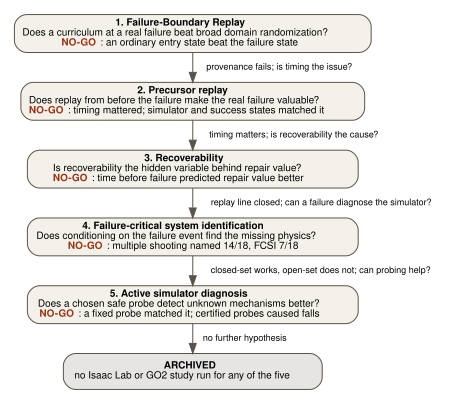

# Ashfall

**A negative-results study of failure-driven robot learning and simulator diagnosis.**

Ashfall investigated whether failures provide uniquely useful information for policy repair and
simulator diagnosis. Across five preregistered CPU studies, increasingly sophisticated
failure-aware methods failed to outperform simpler controls, so no claim was advanced to
quadruped simulation or hardware.

> **Status: Archived research program**
>
> - Five preregistered research lines; all five stopped at their predefined GO/NO-GO gates.
> - CPU toy studies only: a cart-pole crossing a low-friction patch.
> - No Isaac Lab claim, no quadruped claim, no GO2 hardware claim.
> - Frozen results are SHA-256 pinned and checked by the test suite.

**Scope, before anything else.** Every study used a CPU cart-pole or slip toy. Where the
historical documents say "real failure", they mean a failure logged in a hidden simulator
configuration that stands in for the robot. No physical failure data entered Ashfall. No Ashfall
study ran in Isaac Lab, on a quadruped model, or on the Unitree GO2.



| Study | Question | Result | Surviving observation |
|---|---|---|---|
| [FBR](docs/results/FBR_TOY_NEGATIVE_RESULT.md) | Is the actual failure state uniquely useful for repair? | NO-GO | Failure provenance was not special |
| [Precursor](docs/results/PRECURSOR_SWEEP_RESULT.md) | Does starting replay before the failure fix that? | NO-GO | Timing matters; simulator and success states at the same time work as well |
| [Recoverability](docs/results/RECOVERABILITY_RETROSPECTIVE_RESULT.md) | Is recoverability the hidden variable? | NO-GO | An intermediate-recoverability optimum exists; time to failure predicts repair value better |
| [FCSI](docs/results/FCSI_TOY_RESULT.md) | Does conditioning system identification on failure reproduction find the missing physics? | NO-GO | Multiple shooting is stronger; one-step prediction is very informative in the closed set |
| [Active diagnosis](docs/results/ACTIVE_DIAGNOSIS_TOY_RESULT.md) | Can an information-selected safe probe solve the open-world problem? | NO-GO | A fixed probe matches it at far lower cost; model-set-certified safety fails out of set |

> [!IMPORTANT]
> **A model can certify an action as safe under every model it knows and still be wrong when
> reality lies outside that model set.**
>
> Observed in Ashfall's CPU active-diagnosis toy study; not validated on a quadruped or physical
> robot. Active probes passed the safety check under every plausible in-library model, yet 3 of 18
> executed active probes on unknown-mechanism worlds caused toy falls (fixed and random probes:
> 2 of 24 and 3 of 20 violations on those worlds). This restates a known caveat of model-based
> safety in a concrete setting; it is not a new theorem, a general safety law or a GO2 finding.

## The five studies

**1. Failure-Boundary Replay (FBR).** *Is the actual failure state uniquely useful?* FBR trained
near the friction boundary of a failure. Against broad domain randomization (DR) it had 2.7 pp
lower held-out failure, but the difference was not significant (95% CI -6.1 to +0.6, p = 0.105),
so the preregistered primary did not reject. Nominal success fell by 6.5 pp against a -2 pp
margin. The same replay seeded from an ordinary patch-entry state beat the failure-state replay
by 3.6 pp (p = 0.0029), which undermines the failure-provenance hypothesis.
**NO-GO.** Surviving observation: failure provenance was not special.

**2. Precursor replay.** *Does starting before the failure fix that?* Replay from 1.5 s before
onset beat onset replay by 13.5 pp and beat broad DR (-11.0 pp) and ADR (-12.4 pp) on hidden
worlds while keeping nominal performance. But a simulator-found failure, a successful run at the
same time and a plain nominal entry state did as well (+0.5, +0.2, +0.0 pp; p = 0.50, 0.83,
0.997). **NO-GO.** Surviving observation: timing matters substantially; states from simulator
failures or successes at the same time work as well.

**3. Recoverability.** *Is recoverability the hidden variable?* Across 180 replay states, repair
value peaked at intermediate recoverability (0.48, 95% interval 0.45 to 0.50), a pattern known
from curriculum learning. Time before failure predicted repair value better (leave-one-world-out
RMSE 4.04 vs 4.38 pp), and so did distance to the hazard (4.29 pp). **NO-GO.** Surviving
observation: intermediate recoverability exists, but simple time to failure predicted repair value
better.

**4. Failure-critical system identification (FCSI).** *Does conditioning identification on
reproducing the failure find the missing physics?* Whole-trajectory fitting named the true
mechanism in 3 of 18 cases, FCSI in 7, reset-based multiple shooting in 14. Even correct models
reproduced the logged failure only 2% to 41% of the time, so the event was a poor criterion. An
exploratory one-step selector named 18 of 18 known mechanisms but named a wrong one on all 8
out-of-library cases. **NO-GO.** Surviving observation: whole-trajectory fitting can miss local
failure dynamics, but multiple shooting is stronger; local one-step prediction was very
informative in the closed set.

**5. Active diagnosis.** *Can an information-selected safe probe solve the open-world problem?*
The active probe scored 38 of 42, the same as an optimized fixed probe (38) and close to a random
safe probe (37). Selecting it cost about 3.5M simulated steps per diagnosis against about 121k
for the fixed probe. Passive abstention already rejected 10 of 12 unknown mechanisms (active: 11).
**NO-GO.** Surviving observation: a simple fixed probe matched the active probe at far lower
search cost, and model-set-certified safety failed under out-of-library dynamics.

**Archived.** No further hypothesis was generated.

## What Ashfall does not claim

- that real robot failure states are uniquely valuable for policy repair;
- that precursor replay is superior to simulator-generated replay;
- that recoverability-guided replay is novel or superior;
- that FCSI improves system identification;
- that active probe generation improves open-set diagnosis;
- that any result transfers to quadrupeds, to Isaac Lab or to a Unitree GO2;
- that any method was validated on hardware or with physical data.

The evidence hierarchy is in [`EVIDENCE.md`](EVIDENCE.md); lessons across the studies are in
[`docs/LESSONS_LEARNED.md`](docs/LESSONS_LEARNED.md); the formal record is
[`docs/ARCHIVE.md`](docs/ARCHIVE.md).

## Why this repository exists

Each Ashfall hypothesis had to earn advancement to the next experimental scale. None did. The
project therefore stayed CPU-only instead of consuming Isaac Lab or physical-robot time after its
claims had already failed cheaper tests. The repository records how those decisions were made:

- **Preregistration.** Each gate, its baselines and its code were fixed before the run
  (recoverability used an exploratory analysis plan frozen before estimation).
- **Falsification.** Each study was designed so that its main claim could fail, and each did.
- **Strong baselines.** Broad DR and ADR at matched compute, matched successful and
  simulator-found states, multiple shooting, and fixed and random probes. Every proposed method
  beat a weak baseline and lost to or tied with one of these.
- **Stopping rules.** A failed gate ended the line of work; no gate was retuned after its result.
- **Immutable evidence.** Result records, preregistrations and artifacts are SHA-256 pinned and
  checked by the test suite.
- **Provenance.** Every run records its code revision, configuration, seeds and input hashes.
- **Reproducible negative findings.** The commands below regenerate the studies on a CPU.

## Reproducing the studies

```bash
pip install -e ".[dev]"
pytest -q            # CPU only; includes every frozen-artifact and public-release check
ruff check .
mypy                 # typed core only (see pyproject.toml)
```

Set `OMP_NUM_THREADS=1` for the parallel studies; multithreaded BLAS in every worker
oversubscribes the CPU (the first FCSI launch stalled this way). Write reruns to a new
directory, never over `results/`.

| Study | Command | Frozen record | Recorded cost |
|---|---|---|---|
| FBR toy v1 (exploratory) | `python -m ashfall.fbr.toy_study --output <dir>` | [`results/fbr_toy/`](results/fbr_toy) | 150 s (archive rerun) |
| FBR toy v2 (the gate) | `python -m ashfall.fbr.toy_study_v2 --output <dir>` | [FBR result](docs/results/FBR_TOY_NEGATIVE_RESULT.md) | not recorded |
| Precursor sweep | `python -m ashfall.fbr.time_sweep --stage 1 --output <dir>`, then `--stage 2` with the same `<dir>` | [precursor result](docs/results/PRECURSOR_SWEEP_RESULT.md) | not recorded |
| Recoverability | `python scripts/recoverability_retrospective.py --output <dir>` | [recoverability result](docs/results/RECOVERABILITY_RETROSPECTIVE_RESULT.md) | 7.6 s, 20 workers |
| FCSI | `python -m ashfall.fcsi.toy_study --output <dir>` | [FCSI result](docs/results/FCSI_TOY_RESULT.md) | 1,058 s, 22 workers |
| Active diagnosis | `python -m ashfall.active_diag.study dev --output <dir>`, then `eval` with the same `<dir>` | [active diagnosis result](docs/results/ACTIVE_DIAGNOSIS_TOY_RESULT.md) | dev 66 s; eval 109 s, 22 workers |

Every command except the recoverability script and the active-diagnosis study also accepts
`--quick` for a software check at a tiny budget. What the archive reruns reproduced
byte-for-byte, and the one known nondeterminism (a permutation p-value that varies with Python's
hash seed without changing the decision), are in
[`EVIDENCE.md`](EVIDENCE.md#reproduction-checks).

## Frozen results

| Study | Preregistration | Result commit | Result record | Hash-pinned artifacts | Status |
|---|---|---|---|---|---|
| FBR | `8f49f02` (toy v2 gate) | `08adcff`; record frozen at `48c8c71` | [FBR_TOY_NEGATIVE_RESULT.md](docs/results/FBR_TOY_NEGATIVE_RESULT.md) | 14 + record + preregistration | NO-GO |
| Precursor | `3205f02` | `dfec130` | [PRECURSOR_SWEEP_RESULT.md](docs/results/PRECURSOR_SWEEP_RESULT.md) | 16 + record + preregistration | NO-GO |
| Recoverability | `2227de1` (exploratory analysis plan) | `61bb95d` | [RECOVERABILITY_RETROSPECTIVE_RESULT.md](docs/results/RECOVERABILITY_RETROSPECTIVE_RESULT.md) | 5 + record + plan | NO-GO |
| FCSI | `1b657c1` | `d49daeb` | [FCSI_TOY_RESULT.md](docs/results/FCSI_TOY_RESULT.md) | 4 + record + preregistration | NO-GO |
| Active diagnosis | `b86006d` (code `2b3e40e`) | `4186bbf` | [ACTIVE_DIAGNOSIS_TOY_RESULT.md](docs/results/ACTIVE_DIAGNOSIS_TOY_RESULT.md) | 5 + record + preregistration | NO-GO |

The commit hashes belong to the private research history, which is not published; every one is
listed with its date and subject in [`docs/RESEARCH_HISTORY.md`](docs/RESEARCH_HISTORY.md). Artifact
hashes are listed inside each result record and recomputed by `tests/test_frozen_results.py`. One
artifact is published as a sanitized copy with local path text removed; the
[public artifact manifest](docs/PUBLIC_ARTIFACT_MANIFEST.md) records both hashes and the exact
transformation.

## Repository map

| Path | Contents |
|---|---|
| [`docs/ARCHIVE.md`](docs/ARCHIVE.md) | the formal project record |
| [`docs/LESSONS_LEARNED.md`](docs/LESSONS_LEARNED.md) | technical lessons across the five studies |
| [`EVIDENCE.md`](EVIDENCE.md) | what is verified and what is not |
| [`docs/PUBLIC_ARTIFACT_MANIFEST.md`](docs/PUBLIC_ARTIFACT_MANIFEST.md) | every published artifact against the private archive |
| [`docs/RESEARCH_HISTORY.md`](docs/RESEARCH_HISTORY.md) | the private research commits cited by the records |
| [`docs/results/`](docs/results) | the five frozen result records and the transition notes |
| [`docs/research/`](docs/research) | preregistrations, analysis plan, related-work audits, FBR method |
| [`docs/legacy/`](docs/legacy) | superseded designs, runbooks and the pre-study Phase-I record |
| `src/ashfall/fbr/`, `recoverability/`, `fcsi/`, `active_diag/` | code for the five studies |
| `results/` | committed run outputs; frozen entries are hash-pinned |

Earlier Ashfall designs (a reset-file curriculum in Isaac Lab, then a causal-reproduction design)
predate the five studies; their code and evidence are kept and described in
[`docs/legacy/README.md`](docs/legacy/README.md). They are not results of the five studies.

## Final status

**Archived.** Five research hypotheses were tested under explicit gates. None justified
advancement to quadruped simulation or hardware. The project is preserved because the negative
results themselves are reproducible and informative.

Work under the Ashfall name should resume only if independent physical-robot evidence reveals a
new phenomenon not explained by these studies.

## License

MIT
