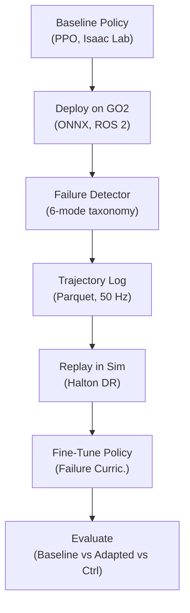

# Ashfall

[](LICENSE)

**Failure-driven policy adaptation for the Unitree GO2: detect locomotion failures, replay them in simulation, fine-tune the policy on them, and then measure honestly whether any of it helped.**

The idea is intuitive enough that most projects would ship it on a single seed and call it a result. A quadruped slips on low-friction ground, you log the trajectory, reconstruct the failure in sim with domain randomization, and fine-tune the policy on a curriculum enriched with those failure cases. Ashfall builds that entire loop (a 6-mode failure detector, a synthetic failure generator, a sweep runner, and a paired statistical evaluation layer) and then runs the experiment that usually gets skipped: the same curriculum across 11 random seeds, paired seed by seed, scored with an exact sign-flip permutation test.

It does not work. The headline is a null result, and it is the point of the repo.

## Headline result: the failure curriculum shows no reliable effect (n=11 seeds, paired)

A single seed (42) suggested a +5.1 pp lift in slippery-terrain success rate at `failure_fraction=0.5`. Paired across seeds, that lift disappears and never comes back. Adding seeds moved the p-value *away* from significance, not toward it.

| terrain  | n  | mean delta (ff=0.5 minus ff=0.0) | 95% CI (t, df=n-1) | seeds positive | exact two-sided sign-flip p | p-floor | clears alpha=0.05 |
|:---------|---:|---------------------------------:|:-------------------|:---------------|----------------------------:|--------:|:------------------|
| slippery |  7 | -1.099 pp | [-5.204, +3.006] pp | 4 / 7  | 0.5625 | 0.0156 | no |
| slippery | 11 | -0.416 pp | [-2.823, +1.992] pp | 7 / 11 | 0.7266 | 0.0010 | no |
| rough    |  7 | -1.578 pp | [-6.308, +3.153] pp | 2 / 7  | 0.3906 | 0.0156 | no |
| rough    | 11 | +0.548 pp | [-3.463, +4.560] pp | 5 / 11 | 0.7676 | 0.0010 | no |

The sample is not the problem. The p-floor column is `2 / 2**n`, the smallest exact sign-flip p reachable at that sample size: at n=11 it is 0.0010, so alpha=0.05 is structurally reachable and the test simply does not get there. **The null verdict HOLDS at n=11 on both terrains.** Full per-seed deltas, the exact commands, and the config-comparability audit are in [`results/multiseed_scale_ext_2026-06-02_ANALYSIS.md`](results/multiseed_scale_ext_2026-06-02_ANALYSIS.md).

Known caveat, stated rather than buried: three of the four newest slippery `ff=0.0` cells sit at or near a 100% success ceiling (0.9922, 1.0000, 0.9922), so their deltas are mechanically clamped toward zero. The terrain configs were diffed and are identical, so this is a ceiling effect and not a confound, but it means part of the n=11 shrinkage toward zero is mechanical rather than fresh independent evidence. A future extension should pick seeds whose baseline slippery success leaves headroom below 0.95.

## What survives the null

| Component | Status | Evidence |
|-----------|--------|----------|
| 6-mode failure detector | Validated, defensible contribution | 18 / 18 synthetic parquets classified correctly, zero cross-fires (2026-04-19) |
| Experiment + evaluation framework | Reusable regardless of the curriculum result | sweep generator, paired analysis, exact sign-flip permutation tests, BCa bootstrap |
| Seed-propagation fix | Real bug fixed upstream | go2-phoenix `FailureCurriculum` patch (`d42ee01`), which had masked seed-driven variance in prior curriculum-style ablations |
| Failure-fraction curriculum | **Does not work** | table above |
| Real-hardware failure data | Not collected | synthetic failures only, see [Limitations](#limitations) |
| Test suite | 113 tests passing | `python3 -m pytest tests/` |

Three viable directions next: (1) re-design the curriculum (a research pivot, not a parameter sweep), (2) a mode-subset ablation at ff=0.5 with explicitly exploratory framing, (3) hardware data collection, since synthetic failures may simply not generalize. See methodology section 5c for the tradeoffs.

## The Ashfall Loop


```mermaid
graph TD
    A["Baseline Policy<br/>(PPO, Isaac Lab)"]
    B["Deploy on GO2<br/>(ONNX, ROS 2)"]
    C["Failure Detector<br/>(6-mode taxonomy)"]
    D["Trajectory Log<br/>(Parquet, 50 Hz)"]
    E["Replay in Sim<br/>(Halton DR)"]
    F["Fine-Tune Policy<br/>(Failure Curric.)"]
    G["Evaluate<br/>(Baseline vs Adapted vs Ctrl)"]
    A --> B
    B --> C
    C --> D
    D --> E
    E --> F
    F --> G
```

## Failure Taxonomy

Ashfall classifies quadruped locomotion failures into 6 modes, ordered by severity:

| Mode | Sev. | Detection | Sim Replay Strategy |
|------|------|-----------|---------------------|
| Body Collapse | 5 | base_height < 0.15 m | Vary terrain + joint stiffness |
| Attitude Loss | 4 | \|pitch\| > 0.8 rad or \|roll\| > 0.6 rad | Sweep friction + push forces |
| Foot Slip | 3 | cmd > 0.3 m/s, actual < 0.05 m/s for 0.5 s | Low-friction terrain, sweep coeff. |
| Stumble | 2 | max \|joint_vel\| > 15 rad/s with feet in contact | Add terrain obstacles at swing height |
| Contact Loss | 2 | >= 2 feet below 5N for >= 0.1 s | Vary slope and surface irregularity |
| Command Mismatch | 1 | \|cmd - actual\| > 0.4 m/s for > 1.0 s | Sweep mass + actuator strength |

### Taxonomy validation (2026-04-19, no GPU)

The 6-mode `FailureDetector` was exercised against 18 synth parquets (6 modes x 3 variants) generated by `scripts/generate_failures.sh`. Every parquet's designed failure mode was correctly detected with zero cross-fires:

| mode | detected | cross-fires |
|---|---:|---:|
| attitude | 3 / 3 | 0 |
| collapse | 3 / 3 | 0 |
| slip | 3 / 3 | 0 |
| stumble | 3 / 3 | 0 |
| contact_loss | 3 / 3 | 0 |
| command_mismatch | 3 / 3 | 0 |

## Experimental history

### The 2026-05-08 seed-scaling pass (n=7, paired)

3 pilot seeds (42, 123, 7) plus 4 scaling seeds (99, 314, 1729, 2718) at ff in {0.0, 0.5} on Phoenix `audit-fixes-2026-04-16` plus commit `d42ee01` (FailureCurriculum seed-propagation fix). 200-iter PPO fine-tune from the rough baseline, 128-140 eval episodes per cell per terrain. 14 cells total, all rc=0. This is the analysis the n=11 extension pooled into; its per-terrain summary statistics were:

| terrain  | ff=0.0 mean (SE) | ff=0.5 mean (SE) |
|----------|------------------|------------------|
| slippery | 0.898 (0.011)    | 0.887 (0.012)    |
| rough    | 0.920 (0.016)    | 0.905 (0.013)    |

Honest verdict at that stage, unchanged by the extension:

- **Slippery: no reliable effect.** 4/7 positive is roughly a coin flip. Per-seed deltas span +3.6 pp to -8.85 pp. The pilot's "3/3 positive" framing was a small-sample artifact.
- **Rough: regresses on average** at n=7 (mean -1.58 pp), and settles near zero at n=11 (+0.55 pp). Either way there is no reliable gain.

Full numbers: [`results/multiseed_scale_ext_2026-06-02_ANALYSIS.md`](results/multiseed_scale_ext_2026-06-02_ANALYSIS.md). Methodology: [`docs/methodology/ff_sweep_rigor.md`](docs/methodology/ff_sweep_rigor.md) section 5c.

### Earlier single-seed results (kept for context, not for citation)

The v0.2.0 baseline-vs-adapted comparison and the v0.3.0 6-cell `failure_fraction` sweep (single seed=42) reported +9.4 pp and +5.1 pp slippery lifts respectively. Neither replicates under paired multi-seed analysis. The 2026-05-07 n=3 pilot looked directionally positive (3/3 seeds) but flipped under scaling. Details retained in `notes/2026-05-07-{sweep-verification,multiseed-verdict}.md` and in methodology sections 5b and earlier.

The ablation-sweep generator (`scripts/run_ablation.sh`) produces 6 `failure_fraction` cells (0.0, 0.1, 0.25, 0.5, 0.75, 1.0) with per-cell `commands.sh` stubs ready to execute inside Isaac Lab. The analysis pipeline (`scripts/analyze.sh`) consumes the results directory and writes `results/REPORT.md` with full tables and plots.

## Project Structure

| Path | Contents |
|------|----------|
| `src/ashfall/taxonomy/` | 6-mode failure detector (pure numpy): `detector.py` stateful multi-mode classifier, `schema.py` taxonomy metadata |
| `src/ashfall/experiment/` | Config/result dataclasses, pipeline orchestration (generates Isaac Lab commands), ablation sweep generation |
| `src/ashfall/evaluation/` | Multi-condition comparison, bootstrap CI, failure-specific metrics (recurrence, intervention) |
| `src/ashfall/analysis/` | Matplotlib plots, markdown tables, auto-generated experiment report, multi-seed paired analysis |
| `src/ashfall/synth/` | Synthetic failure generation for all 6 modes |
| `configs/` | Named experiment configs (baseline, adapted, control, ablation) and `taxonomy.yaml` detection thresholds |
| `scripts/` | Shell scripts for reproducible runs |
| `data/failures/` | Failure trajectory Parquets (synthetic and hardware) |
| `results/` | Experiment outputs: metrics, plots, reports, multi-seed analyses |
| `tests/` | 113 unit tests |

## Dependencies

Ashfall builds on [go2-phoenix](https://github.com/yusufdxb/go2-phoenix) for Isaac Lab simulation, PPO training, and sim-to-real export. Phoenix handles the sim/training/deployment side; Ashfall adds the experiment, evaluation, and adaptation orchestration layer.

| Component | Source |
|-----------|--------|
| Isaac Lab GO2 env | go2-phoenix `sim_env/` |
| PPO training | go2-phoenix `training/` (rsl_rl) |
| ONNX export | go2-phoenix `sim2real/` |
| ROS 2 deploy | go2-phoenix `sim2real/` |
| Failure detection | **Ashfall** `taxonomy/` (extends Phoenix's 3 modes to 6) |
| Trajectory logging | go2-phoenix `real_world/` |
| Replay + DR | go2-phoenix `replay/` |
| Failure curriculum | go2-phoenix `adaptation/` |
| Experiment management | **Ashfall** `experiment/` |
| Evaluation harness | **Ashfall** `evaluation/` |
| Analysis pipeline | **Ashfall** `analysis/` |
| Synthetic failures | **Ashfall** `synth/` |

## Quick Start

```bash
# Install
pip install -e ".[dev]"

# Run tests (no GPU required)
python3 -m pytest tests/ -v

# Generate synthetic failure data
./scripts/generate_failures.sh

# Prepare an experiment (generates Isaac Lab commands)
./scripts/run_experiment.sh configs/experiments/baseline.yaml

# Generate analysis report
./scripts/analyze.sh results/
```

### Running Experiments (requires Isaac Lab + GPU)

```bash
# Set environment
export ISAACLAB_PATH=$HOME/Sim/IsaacLab
export PHOENIX_ROOT=$HOME/workspace/go2-phoenix

# Train baseline (500 iters, ~28 min on the Blackwell consumer GPU)
./scripts/run_experiment.sh configs/experiments/baseline.yaml

# Train adapted policy (200 iters from baseline checkpoint)
./scripts/run_experiment.sh configs/experiments/adapted.yaml

# Run control condition
./scripts/run_experiment.sh configs/experiments/control_random.yaml

# Run ablation sweep
./scripts/run_ablation.sh configs/experiments/ablation_sweep.yaml

# Generate report
./scripts/analyze.sh
```

## Ablation Plan

| Axis | Values | Hypothesis |
|------|--------|------------|
| Failure fraction | 0.0, 0.1, 0.25, 0.5, 0.75, 1.0 | More failure data improves adaptation up to a point |
| Failure modes | single-mode vs all-mode | Multi-mode curriculum is more robust |
| Adaptation iters | 50, 100, 200, 400 | Diminishing returns past 200 iters |
| Domain randomization | narrow vs wide | Wider DR improves transfer but may hurt convergence |

The first axis has now been tested and the hypothesis is rejected at n=11.

## Evaluation Metrics

| Metric | Description |
|--------|-------------|
| Success rate | Episodes completing without early termination |
| Mean return | Average cumulative reward per episode |
| Failure rate | Failures per episode |
| Intervention count | Episodes requiring human intervention (collapse/attitude) |
| Failure recurrence | Same failure mode re-occurring after adaptation |
| Recovery time | Steps from failure detection to stable state |
| Velocity tracking error | Mean command-actual velocity difference |

## Hardware

- **Robot:** Unitree GO2 EDU
- **Onboard compute:** Jetson Orin NX (16 GB)
- **Training GPU:** NVIDIA (Blackwell) consumer GPU
- **Sim:** NVIDIA Isaac Lab (Isaac Sim 4.5+)
- **Middleware:** ROS 2 Humble

## Limitations

- **The failure-fraction curriculum effect did not survive paired multi-seed analysis.** At n=11: slippery 7/11 positive, mean -0.42 pp, p=0.7266; rough 5/11 positive, mean +0.55 pp, p=0.7676. Neither clears alpha=0.05. Any future "the curriculum works" claim needs a different curriculum design or a different sample population.
- **Ceiling effect in the newest slippery cells.** Three of the four 2026-06-02 seeds start at or near 100% slippery success at ff=0.0, so their deltas are clamped toward zero. Terrain configs were verified identical, so this is not a confound, but the magnitude of the n=11 shrinkage is partly mechanical.
- **Real hardware failures not yet collected.** Synthetic failures are physics-approximate, not sim-grade. Synth-only training may not generalize; real-failure replay is untested.
- **Per-episode metric arrays not retained by Phoenix `evaluate.py`.** The current evaluation pipeline emits aggregate scalars per cell, which limits BCa bootstrap and per-mode breakdown to curriculum-input pool composition rather than eval-time failure-mode counts. A Phoenix-side patch to retain per-episode results is the prerequisite for any defensible mode-subset analysis.
- **No real-robot deployment validation yet.** The ONNX policy passes parity checks but has not been exercised on the live GO2.
- **Mode-subset ablation framing must be exploratory, not confirmatory.** With the aggregate curriculum showing near-zero effect, any positive single-mode cell would need to be reported with a "we looked at six subsets" caveat rather than as a confirmation.

## What Makes This Different

This is not a wrapper around existing tools. Ashfall contributes:

1. **A 6-mode failure taxonomy** grounded in quadruped locomotion failure literature, with stateful detection and per-mode suppression.
2. **An experiment framework** that manages baselines, conditions, ablations, and statistical comparisons as first-class objects.
3. **A failure-specific evaluation layer** that tracks intervention count, failure recurrence, and recovery time beyond standard RL metrics.
4. **Synthetic failure generation** that produces structurally correct training data matching the Phoenix Parquet schema for all failure modes.
5. **A negative result reported as a negative result**, with the seed count, the permutation test, the p-floor, and the ceiling-effect caveat all published rather than a single flattering seed.

The system is designed so that the next hardware session can close the full loop: deploy baseline, collect real failures, replay in sim, adapt, and evaluate.

## License

MIT
