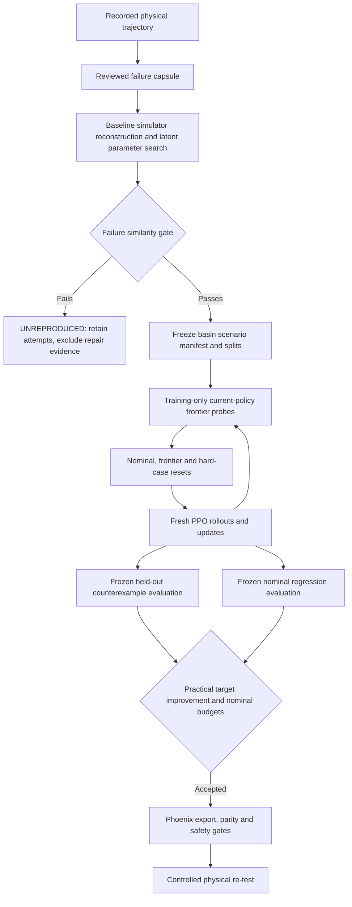

# Ashfall research architecture

## Research question

Can a physical quadruped failure be transformed into a reproducible simulator counterexample, used to repair the locomotion policy around that failure, and verified to reduce failure recurrence without degrading nominal locomotion?

The experimental unit is an independently trained policy. The counterexample unit is a frozen scenario with explicit simulator parameters, recorded initial state, random seed and source capsule. A detector label is neither a cause nor a reproduced counterexample.

## System boundary

Ashfall owns capsules, reproduction criteria, search design, frontier estimation, curriculum sampling, experimental manifests and acceptance. Phoenix owns simulator root/joint state writes, command-manager adapters, exact supported dynamics writes, PPO and deployment. Ashfall never inserts recorded transitions into PPO minibatches.

## Capsule contract

`ashfall.capsule.FailureCapsule` schema `1.0` stores the entire available trajectory and inclusive reviewed start/onset/end indices. Every frame has a timestamp in seconds. Quaternion order is xyzw, orientation rotates body into world, and root velocities are body-frame. Optional channels are explicitly null. A missing required reset channel blocks reset, while missing surface or actuator context remains available for review and declared search.

Required capsule descriptors include source, robot, control period, failure label, onset and reviewed window. Policy identity, checkpoint hash, source trajectory hash, timestamp, detector version and threshold version are supported. Unknown legacy provenance stays null rather than being invented. Frame channels cover pose, root velocity, joint position/velocity, actions, commands, contacts, torque/current and IMU. Context maps cover environment, surface/terrain, disturbances, payload and actuator settings. Content hashes detect changed serialization. Parquet migration preserves the original row numbering and supports multiple events.

The preferred reset is the last recorded frame at or before onset minus 0.5 seconds, configurable per protocol. Out-of-window requests fail; they never silently clamp to row 0. Phoenix keeps `first` and legacy naming aliases explicit. Its simulator adapter rotates both velocity vectors into world coordinates, writes joints/root state, restores the command, disables heading/standing overrides and holds the command for the reconstructed episode. This is constant-command reconstruction, not replay of a changing command sequence. Varying-command failures need a scheduled command adapter before making that claim.

## Reproduction and parameter search

`ReproductionGate` binds capsule, baseline checkpoint identity, seed row, fixed replicate seeds and similarity criteria. Mode match is mandatory. Configurable scores compare failure latency, attitude summary, velocity deviation and contact signature when target measurements exist. Required target channels missing from simulated observations receive no credit. Optional termination matching is explicit. This is summary similarity, not proof of identical trajectories or unique causal identification.

The Halton search treats unknown simulator parameters as candidate hypotheses. Every attempt, including failed attempts, is retained. A result is `REPRODUCED` only when the configured fraction of replicates exceeds the similarity threshold; otherwise it is `UNREPRODUCED`. Gate thresholds and search support must be frozen before baseline fitting. Increasing search budget after failure creates a new protocol version. Reproduction-fit episodes cannot also count as held-out evidence.

The first concrete dynamics adapter controls robot-shape static/dynamic friction with readback. It does not infer terrain coefficients, contact combine modes, hidden payload or actuator history. Unsupported parameters fail explicitly. Terrain geometry, terrain material, contact combination, randomization and simulator versions must be fixed and recorded separately. Matching failure behavior may have multiple explanations; physical parameter measurements and interventions are needed to distinguish them.

## Basin and split discipline

`discover_basin` samples declared bounds and assigns train/validation/held-out membership before collecting outcomes. `ScenarioManifest` rejects duplicate identities and identical physical parameter/state cases across splits, even with changed seeds. Scenario IDs exclude the split label, so relabeling a held-out case cannot produce a new identity. Each scenario binds capsule, reproduction, initial-state hash, parameter vector and scenario seed.

Replicate evaluation persists policy ID, evaluation seeds, individual failure booleans and descriptors. Estimated probabilities and Wilson intervals are conditional on that scenario and fixed policy. Halton sampling covers the stated parameter box; it does not establish coverage outside that box or posterior physical parameter probability. Local bounds and separate capsule-held-out studies are needed for broader generalization.

## Frontier

`FrontierEstimator` fits weighted isotonic failure proportions along an explicitly declared severity axis. Equal-severity observations are pooled by replicate count. R10/R50/R90 are interpolated crossings within observed support. Absent crossings are censored, not extrapolated. Monotonicity is a scientific assumption; inspect raw probabilities and stratify other varying parameters before interpreting a one-axis margin causally.

Severity is failure-specific. Examples are `1-dynamic_friction`, push impulse, `1-torque_scale` and obstacle height. Only implemented backend dimensions may be used in an executable experiment. Multidimensional boundary sampling uses observed probabilities and uncertainty; it does not give a uniquely defined scalar robustness radius. Frontier shifts require identical units, severity definitions and support. Independent training-seed uncertainty remains necessary for a repair claim.

## Repair

`RepairCurriculum` samples nominal, frontier and hard-failure resets using an explicit `FrontierSchedule`. Current-policy outcome refreshes include every training scenario; held-out and validation observations are rejected. Sparse-replicate uncertainty contributes to boundary priority. Curriculum draws are stochastic per reset, avoiding a fixed-count rounding rule that can suppress all failure resets in one-environment reset batches.

The executable `ashfall repair` path builds Phoenix PPO, verifies baseline checkpoint loading, installs the scenario reset adapter and pauses between fresh rollout chunks for current-policy probes. Probes execute in isolated simulator subprocesses and return episode outcomes. Their transitions never enter PPO. Probe checkpoints, commands, reset telemetry and candidate hashes are retained. Evaluation and training share only declared scenario configuration and outcome-derived sampling weights. The isolated probe approach is inspectable but has substantial simulator startup and memory cost; optimize only after runtime validation.

Fixed reset-fraction sampling remains a baseline. The historical row-0 experiment is archived separately. Re-running historical artifacts requires its recorded source revision; contemporary fixed-fraction comparisons must state whether corrected pre-onset initialization is shared with frontier repair.

## Regression and evaluation

Phoenix `EpisodeOutcome` schema `2.0.0` stores one completed episode per JSONL row. It distinguishes policy/checkpoint identity, training seed, scenario seed, evaluation seed and parameter sample ID. It records return, duration, success/termination, command/tracking, failure events/modes/onset, intervention criterion and sustained recovery or censoring. The ordinary random evaluator emits null scenario identity, so it cannot masquerade as an exactly paired evaluation. Terminal state is captured before auto-reset.

`ExperimentProtocol` freezes A baseline, B plain fine-tune, C generic DR, D fixed reset curriculum and E frontier repair, with equal fresh rollout budgets for trained arms. At least three training seeds are preselected without screening observed baseline success. `NominalSuite` declares individual cases and backend support; unsupported required cases block acceptance.

`evidence_verdict` requires matching source reproduction, frozen manifest hashes, complete scenario/replicate coverage, correct applied parameter identities and matched policy identities. It derives target recurrence reduction from actual observed modes. The lower paired interval bound must reach a practical improvement margin, and each required nominal stratum must satisfy success, tracking and intervention budgets. A scalar reward average cannot override rejection.

Within-run intervals resample scenario clusters, preserving their replicates. Across-run inference reduces to one effect per independent training seed. Explicit TOST equivalence margins are available; a non-significant difference is never equivalence. Intervals from a finite deterministic suite do not prove population coverage or universal safety.

## Hardware workflow

Capture with the Phoenix logger and synchronized video, review onset and context, build a capsule, reproduce the baseline, freeze held-out scenarios, train and evaluate, then export through ordinary Phoenix parity and safety checks. Only an accepted candidate proceeds to a controlled physical re-test under the [hardware protocol](../hardware/controlled_failure_protocol.md). Hardware logging may lack absolute position, torque, surface or actuator history. These gaps must be resolved or explicitly represented before reconstruction.

## Provenance

Canonical JSON hashes identify configs, scenarios, capsules, reproduction results and manifests. Experiments record both repository SHAs and dirty-worktree patch/untracked hashes, checkpoint hash, config hash, capsule IDs, evaluation manifest hash, training seed, simulator/library versions, UTC time and exact argv. Timestamps do not change deterministic specification identity. Evidence writers reject changed overwrites. Checkpoints and raw logs remain external artifacts; publish their hashes and retrieval instructions when releasing an experiment.

## How Ashfall can fail

- Missing pre-onset state or hidden actuator state makes the recording non-Markovian.
- Detector ambiguity mistakes blockage for slip, creating the wrong target.
- A simulator parameter search fits the outcome through the wrong mechanism.
- Search support excludes the real failure or makes R50 unidentified.
- Training changes the failure mode while apparent target recurrence improves.
- Frontier selection overfits a single capsule or fixed randomization distribution.
- Nominal averages hide stratum regressions; per-stratum gates are mandatory.
- Incomplete or reset-contaminated episode capture biases recovery and recurrence.
- A simulator/library change alters material or observation semantics.
- ONNX parity passes while physical dynamics still invalidate the repair.

The [implementation audit](../audits/legacy_ashfall_audit.md) records what the historical implementation did and did not establish, and the [legacy archive](../legacy/README.md) states the proof boundary those results carry.
