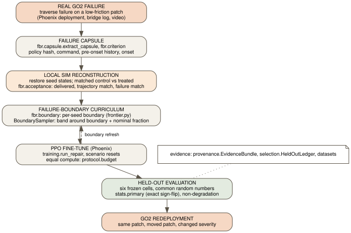

# Ashfall architecture (FBR)

Rendered from [`architecture_fbr.dot`](architecture_fbr.dot) with Graphviz; edit the source.

REAL GO2 FAILURE, then FAILURE CAPSULE, LOCAL SIM RECONSTRUCTION, FAILURE-BOUNDARY CURRICULUM,
PPO FINE-TUNE, HELD-OUT EVALUATION and GO2 REDEPLOYMENT. Everything else is support.

| role | modules |
|---|---|
| capsule | `fbr/criterion.py`, `fbr/capsule.py`, `capsule.py` |
| replay | `fbr/acceptance.py`; Isaac Lab restore and friction readback in `backends/phoenix.py`, `backends/phoenix_interventions.py` |
| curriculum | `fbr/boundary.py`, `frontier.py` |
| training | `training.py` (Phoenix PPO with scenario resets), `scenarios.py`, `repair.py` (scenario plumbing) |
| evaluation | `stats/primary.py`, `evaluation/paired.py`, `evaluation/regression.py`, `selection.py` |
| evidence | `provenance.py`, `datasets.py`, `config_guard.py`, `protocol/budget.py` |

The folder layout was not renamed to match these roles: renaming working modules would have
been churn. `ashfall.fbr` is the only new package.

**Boundary with Phoenix.** go2-phoenix owns the simulator, state restoration, the material and
command adapters it exposes, PPO, ONNX export and deployment. Ashfall imports it lazily inside
the backend and training modules only; the restore contract is pinned in
`backends/phoenix_compat.py`.

**Not yet built for Isaac Lab:** a `BoundarySampler` to Phoenix `Scenario` adapter (so FBR
draws go through `install_scenario_reset`), a spatial patch (per-foot friction switched on entry
and exit, written only on transitions, with readback), and boundary refresh inside the PPO loop
(the v2 frontier-probe hook in `training.py` is the intended seam).

The previous designs remain as supporting-infrastructure references:
[`ashfall_v3.md`](ashfall_v3.md) (matched pairs, D1/D2/D3, H0) and
[`ashfall_v2.md`](ashfall_v2.md) (reproduction gate, basin, frontier repair).
