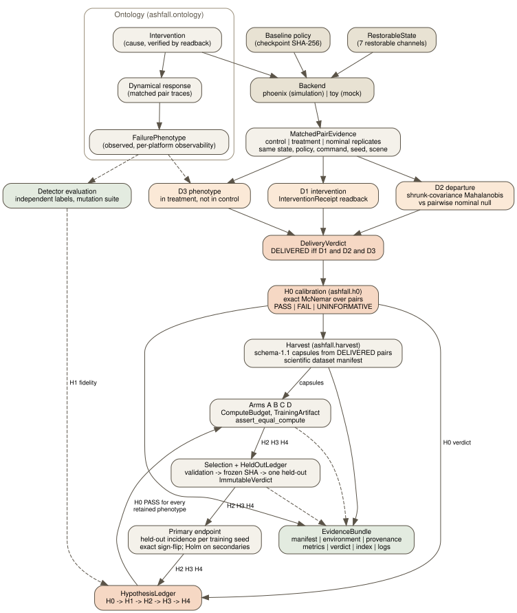

> Supporting infrastructure. The current architecture is [`ashfall_fbr.md`](ashfall_fbr.md); the matched-pair, D1/D2/D3 and H0 machinery described here is retained as supporting and appendix-level validation.

# Ashfall architecture (v3)

The diagram is rendered from [`architecture.dot`](architecture.dot) with
Graphviz; edit the source, not the SVG.

## Boundary

Ashfall owns the ontology, matched-pair evidence, the delivery gates, H0
calibration, harvesting, detector evaluation, the experimental protocol,
selection and held-out locking, statistics, and provenance. go2-phoenix owns
the simulator, state restoration, the intervention primitives it exposes
(material, command buffer, root velocity, actuator gains, masses), PPO and
deployment. Ashfall imports Phoenix lazily and only inside the backend; the
interface it relies on is pinned in `ashfall.backends.phoenix_compat`.

## Modules

| module | role |
|---|---|
| `ontology` | `Intervention`, `PhenotypeSpec` registry, `OnsetWindow`, `PhenotypeObservation`, `FailureEpisode`, `GateResult`, `DeliveryVerdict`, `ReproductionAttempt`, conflation guards |
| `counterfactual` | `RestorableState`, `RolloutTrace`, features on restorable channels, Ledoit-Wolf shrinkage, `measure_departure` (D2), `sensitivity_analysis`, `departure_onset` |
| `gates` | `InterventionReceipt`, D1, D2, D3, `MatchedPairEvidence`, `evaluate_delivery` |
| `h0` | `H0Spec`, deterministic disjoint seeds, `run_h0`, exact McNemar, `summarise_attempts` |
| `harvest` | Phoenix-schema parquet per arm, schema-1.1 capsules from DELIVERED pairs, dataset manifest |
| `backends.phoenix`, `backends.phoenix_interventions` | persistent Isaac Lab scene, `matched_pair`, `nominal_rollout`, readback adapters, `evaluate` |
| `backends.toy` | deterministic mock surrogate for CPU tests and demos |
| `detector_eval`, `taxonomy.phenotype_detector` | independent detector evaluation, mutation suite |
| `protocol.arms`, `protocol.budget`, `protocol.hypotheses` | arms A to D, equal compute, gated hypothesis ledger |
| `selection` | selection protocol, held-out ledger, immutable verdict |
| `stats.primary`, `stats.reference` | primary and secondary endpoints, exact paired test, BCa reference |
| `frontier`, `evaluation.paired`, `evaluation.regression` | identified frontiers, degeneracy-aware intervals, budget gates |
| `provenance`, `datasets`, `config_guard` | content identities, evidence bundles, fixture/scientific split, ignored-config refusal |
| `capsule`, `reproduction`, `scenarios`, `basin`, `repair`, `training` | v2 capsule, reproduction gate, split discipline and PPO integration, retained and adapted |
| `cli` | `h0`, `detector-eval`, `env-snapshot`, plus the v2 artifact commands |

## Data flow for one H0 run

1. A preregistered `H0Spec` (JSON under `configs/h0/`) is loaded; its content
   hash is the spec id.
2. For the Phoenix backend the merged env config is checked by
   `config_guard`; declared-but-unapplied blocks must be acknowledged by name.
3. An `EvidenceBundle` is created; `environment.json` and `provenance.json`
   are written before the simulator runs; the seed plan is written.
4. Initial states are sampled from the policy's own nominal rollout.
5. For each pair: control, treatment and replicate rollouts; D1, D2, D3;
   a `DeliveryVerdict`; two `FailureEpisode`s; a `ReproductionAttempt`.
6. `summarise_attempts` applies the rule; the harvest writes traces, capsules
   and the dataset manifest; metrics and verdict are written; `finalize`
   indexes the bundle.

## Design decisions worth knowing

- **One scene per run.** Control, treatment and replicates share a persistent
  environment so startup-mode randomisation is identical across arms; the
  scene seed is recorded.
- **Receipts, not requests.** Every intervention adapter reads the simulator
  back; a request with no readback fails D1.
- **Null from replicates, not from a fixed sigma.** D2's reference is how
  much nominal rollouts of the same state differ from one another.
- **Fixtures cannot become data.** The manifest kind is checked at every
  scientific consumer.
- **Nothing downstream runs before H0.** The hypothesis ledger refuses it.

The v2 design document, [`ashfall_v2.md`](ashfall_v2.md), describes the
reproduction gate, basin and frontier machinery that v3 retains.
