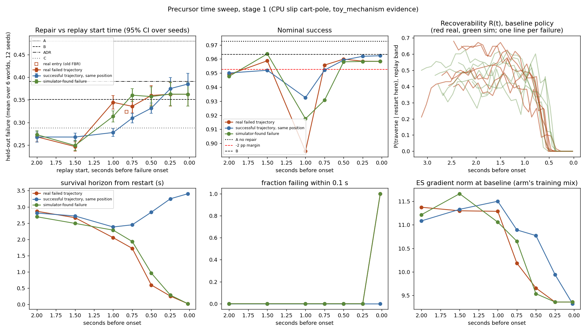
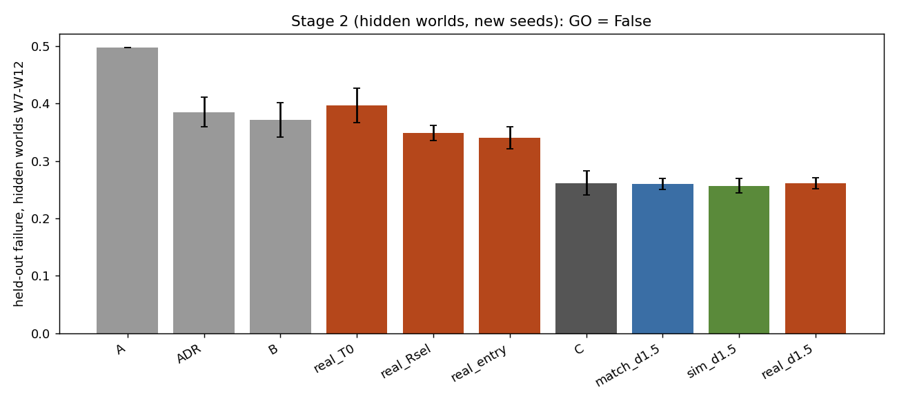

# Replay start time along a failed trajectory: result (CPU toy)

Status: **FINAL. Preregistered gate returned NO-GO.** Do not edit the numbers in this file.

Evidence kind: `toy_mechanism` (slip cart-pole). Nothing here is a GO2 or quadruped result.

- Preregistration: `docs/research/PRECURSOR_SWEEP_PREREGISTRATION.md`, committed with its code at
  `3205f02` (`3205f02fba84d23f06481813afc23d6328dd293e`) before either stage ran.
- Code: `src/ashfall/fbr/time_sweep.py` at `3205f02`. Run commands: `--stage 1`, then `--stage 2`,
  output `results/precursor_toy/3205f02/`. Figures: `scripts/plot_time_sweep.py`.
- Baseline: the frozen toy v2 checkpoint (SHA-256 `2bb2a3bf...e0f3`), checked at load.
- Reproduction checks that ran inside the study: all six discovery capsules were re-derived
  byte-identical to the frozen toy v2 capsules, and the `real_entry` arm reproduced toy v2 arm D's
  held-out failure exactly for every seed and world (`v2_entry_reproduction.all_equal = true`).

## Verdict, plainly

1. **Replay start time matters a lot, in this toy.** The curve has structure (omnibus p = 5e-5)
   and the registered class is **C, interior optimum**, at **T-1.5 s** (P*).
2. **Failure-onset replay teaches almost nothing.** The baseline's recoverability reaches zero
   between 0.52 and 0.26 s before onset on every failure, real or simulated; replays from there
   all fail, their contexts carry no boundary mass, and the real arms at T-0.25 and T0 train
   identically (T-0.5 differs from T0 by only -0.3 pp).
3. **The precursor state beats onset, the old FBR entry seed, broad DR and ADR, and keeps
   nominal performance**, on hidden worlds with new seeds (stage 2).
4. **But the real failure is not what carries the value.** At the same start time, a state from
   a simulator-found failure, a state from a successful traverse at the same position, and plain
   nominal-entry replay all perform the same as the real-failure precursor. G2 and G5 fail.
5. Therefore: **NO-GO.** No precursor method is named or built; no Isaac Lab or GO2 compute is
   spent on it. The honest finding is about *where to restart replay*, not about *real failures*.

## Stage 1 (discovery: toy v2 worlds W1 to W6, toy v2 seeds)

Held-out failure (mean over 6 worlds and 12 seeds) and nominal success:

| start state | real failure | matched success | simulator failure | real nominal success |
|---|---|---|---|---|
| T-2.0 s | 0.268 | 0.268 | 0.273 | 0.949 |
| **T-1.5 s** | **0.247** | 0.268 | 0.249 | 0.959 |
| T-1.0 s | 0.344 | 0.278 | 0.313 | 0.894 |
| T-0.75 s | 0.336 | 0.310 | 0.360 | 0.956 |
| T-0.5 s | 0.360 | 0.332 | 0.357 | 0.960 |
| T-0.25 s | 0.362 | 0.375 | 0.363 | 0.958 |
| T0 (last pre-onset frame) | 0.362 | 0.385 | 0.362 | 0.958 |
| episode start | 0.345 | | | 0.932 |
| patch entry (old FBR, toy v2 D) | 0.324 | | 0.354 | 0.907 |

Global arms: A 0.480, B 0.351, ADR 0.391, C 0.288 (nominal A 0.973, B 0.963, ADR 0.961, C 0.918).

Registered tests:

| test | result |
|---|---|
| omnibus over the seven fixed offsets (20,000 within-seed permutations) | p = 5.0e-5: structure |
| Holm, each pre-failure offset vs T0 | T-2.0: 0.003; **T-1.5: 0.003**; T-0.75: 0.092; T-1.0: 0.67; T-0.5, T-0.25: 1.0 |
| curve class | **C**: t* = T-1.5 beats T0 (-11.6 pp, p 0.0005) and T-2.0 (-2.2 pp, p 0.018); entry does not beat it (+7.7 pp) |
| stage-2 licence | granted (P* = T-1.5) |

Descriptive (stage 1), T-1.5 real against: failure entry -7.7 pp (p 0.0005), B -10.4 pp
(p 0.0005), ADR -14.4 pp (p 0.0005), C -4.1 pp (p 0.005), matched success -2.1 pp (p 0.0005),
**simulator-found T-1.5 -0.2 pp (95% CI -1.8 to +1.3, p 0.74)**. At T-2.0 real equals matched
success (+0.0 pp, p 0.96) and simulator (-0.5 pp, p 0.49). Nominal success of T-1.5 against A:
-1.4 pp, 90% lower bound -2.1 pp (would have narrowly failed the margin on the discovery worlds).



## Stage 2 (hidden worlds W7 to W12, twelve new seeds): the gate

| arm | held-out failure | nominal success |
|---|---|---|
| A no repair | 0.497 | 0.973 |
| ADR | 0.385 | 0.963 |
| B broad DR | 0.371 | 0.957 |
| real T0 | 0.397 | 0.963 |
| real Rsel (latest frame with baseline R >= 0.5, secondary) | 0.349 | 0.959 |
| real entry (old FBR) | 0.340 | 0.906 |
| C nominal entry | 0.261 | 0.955 |
| matched success at T-1.5 | 0.260 | 0.952 |
| simulator-found T-1.5 | 0.257 | 0.955 |
| **real T-1.5 (P*)** | **0.262** | 0.959 |

| gate | comparison (real T-1.5 minus ...) | result | pass |
|---|---|---|---|
| G1 | T0 | -13.5 pp [-16.6, -10.4], p 0.0005 | yes |
| G2 | real entry | -7.9 pp [-10.6, -5.2], p 0.0005 | yes |
| G2 | C nominal entry | +0.0 pp [-2.7, +2.7], p 0.997 | **no** |
| G2 | matched success T-1.5 | +0.2 pp [-1.5, +1.9], p 0.83 | **no** |
| G2 | simulator-found T-1.5 | +0.5 pp [-0.9, +1.9], p 0.50 | **no** |
| G3 | B / ADR | -11.0 pp / -12.4 pp, p 0.0005 each; margin -11.0 pp vs better baseline | yes |
| G4 | nominal success vs A (90% CI) | -1.3 pp [-1.7, -0.9]; tracking +0.027 m/s [0.026, 0.029] | yes |
| G5 | worlds where real beats T0 / B / simulator | 6 / 6 / **3** of 6 | **no** |
| **Decision** | | | **NO-GO** |

Secondary: the recoverability selector (`Rsel`, leads 0.6 to 1.1 s) beat T0 (-4.8 pp, p 0.002)
but lost to the fixed T-1.5 offset (+8.7 pp worse, p 0.0005): the latest still-recoverable state
is itself too late.



Compute: every replay arm trained 120 ES iterations; B trained 130 and ADR 129 so that each spent
at least as many simulator steps as the most expensive replay arm (17.47M and 17.48M vs at most
17.39M steps per seed; the Rsel probes set the overhead). Not charged, as registered: the stage-1
sweep that chose P*, which both `real_P*` and `sim_P*` share.

## Mechanism (what the diagnostics show, and no more)

- **Recoverability collapses late.** Baseline traverse success from a restored state is 0.23 to
  0.68 at 1.0 to 2.5 s before onset and is zero from a point between 0.52 and 0.26 s before onset until onset, on
  all twelve failures (six real, six simulated). By T-0.5 s mean survival from the restart is
  0.6 s (real) and boundary mass 0.04; at T-0.25 and T0 it is 0, and the ES gradient falls to the
  floor set by the broad-DR half of the batch. Inferred from the toy's force law, not measured:
  once the cart slips, delivered force saturates at the kinetic traction limit whatever the policy
  requests, so the action has little authority over the outcome.
- **Earlier is better until the approach.** T-2.0 and T-1.5 lie on the approach, about 0.7 to 1.2 s
  before patch entry. Interpretation, not separately tested: replays there train the approach to
  the patch (speed and attitude on entry), which decides the traverse. Patch-entry replay (the old FBR seed, about 0.8 s before
  onset) is already late: close to the collapse and with the worst nominal cost.
- **Nothing in the state is failure-specific.** On the approach, the failed trajectory, a
  successful trajectory and a simulator failure are nearly the same state (same position, similar
  speed, random gait phase). They produce the same repair. What matters is the *time before the
  hazard* and the friction band, not the fact that this trajectory failed.

The simplest summary the data support: in this toy, useful replay starts where the policy still
has control authority over the approach to the hazard; any state there works, whatever its
origin. A formal recoverable-set model is not fitted and is not claimed.

## Consequences (preregistered)

- The precursor method is **not named and not built**. No Isaac Lab failure generation,
  recoverability map, training arms or GO2 phases are run for it.
- FBR and the precursor-from-real-failure hypothesis are **archived as negative results**.
- The strongest defensible claim: *in a CPU slip toy, repair replay seeded before the loss of
  control authority beats replay seeded at failure onset or at patch entry, and beats broad DR and
  ADR at equal compute, but real failed trajectories added no value over simulator-found or
  successful states at the same time before the hazard.*
- Not claimed: anything about the GO2 or Isaac Lab; that failure data never helps; that T-1.5 s
  transfers to other systems (it is a property of this toy's speeds and patch geometry).

## Artifact index (SHA-256; immutable, checked by `tests/test_frozen_results.py`)

```
4af4500580271936910b352da1f09e2ebae1bbe0f62f180c696e92d760d0e63d  results/precursor_toy/3205f02/stage1.json
778854d2484b44aa2402893ba618970ed671bdfd10354805bef06df3f2c4724c  results/precursor_toy/3205f02/stage2/stage2.json
d9dcce4018bde8aafbffe402c71691002c7d915f5e2c463c6381f689e52926bc  results/precursor_toy/3205f02_stage1.log
9c49b0c0baa6389914a47cb6d4ef8241051807c1853a40e1d14be48abfefa477  results/precursor_toy/3205f02_stage2.log
3ab803598ff9668994dca12da5a8d672dd5d3c4f7f63b45f1f7f203fc4dbb47a  results/precursor_toy/3205f02/sim_capsule_W1.json
ce09d4528a2cea7ee5b2a4c7a2656ef71abd0dcef9f2ba4231031f07d2e805c3  results/precursor_toy/3205f02/sim_capsule_W2.json
40074f0712d9d2fadb9f2a964428552f6e6a1f7536b7846436e58709471fcac2  results/precursor_toy/3205f02/sim_capsule_W3.json
d2ca421d5bdcc2dccf383bd49ccceed81325213b3ec9c9bc90a1fb7de642f9ac  results/precursor_toy/3205f02/sim_capsule_W4.json
235f56237cd426a5551584ef054dcaaec7e3f3098383e82a29e24191073e0e5b  results/precursor_toy/3205f02/sim_capsule_W5.json
0e2b49c81695b5e5adf01894defd47c0e101993b3bee500e2da276615554bb42  results/precursor_toy/3205f02/sim_capsule_W6.json
9e5f61e4cefdd8f7e56cfc4c5ebeb2f1dbf2ba67473f1d639021a1d8fcfb6a7f  results/precursor_toy/3205f02/stage2/capsule_W7.json
c3a111b3cbf76b6d12b5d4fd58e800236e24206c601840a8a128f5e07c1011d9  results/precursor_toy/3205f02/stage2/capsule_W8.json
4ee703cf1ac5e8d24bbdc81e97c1d5a0ac6e7d5a6210d13a8ea7a79169739319  results/precursor_toy/3205f02/stage2/capsule_W9.json
1d4f690cdc12aa35435d2d00ebfe5aa870d65a284be2d7aa048867ed4aa16a71  results/precursor_toy/3205f02/stage2/capsule_W10.json
4559170d18ad708a0c9f4dd9f377e259b165fefd2990c3975d8dea28ced285be  results/precursor_toy/3205f02/stage2/capsule_W11.json
0bb6a2181ce35256cc133601c47d5cd90077fb1e3bf2cb4e34bee46692f26528  results/precursor_toy/3205f02/stage2/capsule_W12.json
```

The discovery capsules `results/precursor_toy/3205f02/capsule_W{1..6}.json` are byte-identical to
the toy v2 capsules indexed in `FBR_TOY_NEGATIVE_RESULT.md`.
