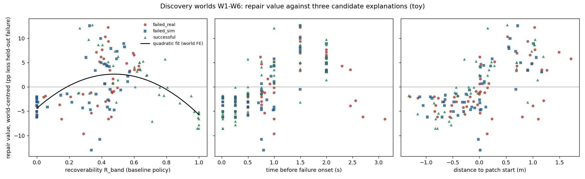

# Is recoverability the hidden variable behind repair value? Retrospective result (CPU toy)

Status: **FINAL. The Phase 7 gate frozen in the analysis plan FAILED, so there is no new
preregistration, no new training study, no Isaac Lab work and no GO2 work for this hypothesis.**
Do not edit the numbers in this file.

Evidence kind: `toy_mechanism` (slip cart-pole). Nothing here is a GO2 or quadruped result.
This is an **exploratory** analysis of data that had already been seen (see the plan's status
line); it can refute the hypothesis but could never have confirmed it.

- Plan, frozen with its code before any estimate existed:
  `docs/research/RECOVERABILITY_RETROSPECTIVE_PLAN.md` at `2227de1`.
- Novelty gate: `docs/research/RECOVERABILITY_RELATED_WORK.md` (`5c744a8`).
- Run: `python scripts/recoverability_retrospective.py --output results/recoverability/retro_2227de1`
  (7.6 s wall on 20 CPU workers). No training.
- Inputs, hash-checked: precursor sweep `stage1.json` (`4af45005...`), `stage2.json`
  (`778854d2...`), frozen toy v2 baseline policy (`2bb2a3bf...`).

## Verdict, plainly

1. **Recoverability and repair value do have a non-monotonic relationship.** Repair value rises
   with `R` from 0, peaks at `R* = 0.48` (two-level bootstrap 95% interval 0.45 to 0.50) and
   falls again; the quadratic term is negative in 100% of 2,000 resamples and both slopes (at
   the 10th and 90th percentiles of `R`) exclude zero. The registered interior-optimum test
   **passes**. The same holds for the common-band definition `R_ref` (`R* = 0.50`, 0.47 to 0.53).
2. **But recoverability does not explain repair value better than simple timing.** On
   leave-one-world-out CV, time before failure beats recoverability (RMSE 4.04 vs 4.38 pp,
   CV R^2 0.43 vs 0.32), and so does distance to the hazard (4.29 pp, 0.35). Adding `R` to time
   (model F) does not improve on time alone (4.11 pp, 0.40). Same ordering for the linear and
   spline families.
3. **On the hidden worlds the recoverability rule chose worse states than the time rule.**
   Fitted on W1 to W6 only and applied to W7 to W12, selecting the state closest to `R*` gave
   mean repair value 21.7 pp and mean regret 3.4 pp; selecting the state closest to the fitted
   best lead time gave 23.2 pp and 1.9 pp regret; onset replay gave 10.0 pp and 15.1 pp regret;
   a random candidate 18.6 pp. Out-of-sample within-world R^2: time 0.62, distance 0.59,
   recoverability 0.34 (Spearman 0.91, 0.79, 0.39).
4. **Provenance adds little once `R` is in the model** (permutation p = 0.074, 3.8% of residual
   variance, no LOWO gain), consistent with the precursor sweep's provenance null.
5. **Therefore: NO-GO.** Recoverability is not the hidden variable. It separates useless states
   from usable ones, but where in the usable range repair works best is decided by timing along
   the approach, which `R` does not capture. Per the plan, Phase 7 is not entered and the
   recoverability-repair hypothesis is archived. No replacement method is proposed.

## Phase 7 gate (frozen in the plan)

| condition | result | pass |
|---|---|---|
| `R` beats time on LOWO CV (lower RMSE and higher R^2) | 4.38 vs 4.04 pp; 0.32 vs 0.43 | **no** |
| `R` beats distance on LOWO CV | 4.38 vs 4.29 pp; 0.32 vs 0.35 | **no** |
| interior optimum, or significant monotone slope | interior optimum at 0.48 | yes |
| provenance adds little (p >= 0.05 and < 5% LOWO gain) | p 0.074, no gain | yes |
| `R` rule regret on hidden worlds not worse than time rule | 3.4 vs 1.9 pp | **no** |
| **gate** | | **FAIL** |

## Why the inverted U exists and still loses (descriptive, discovery worlds)

Mean `R_band` and repair value by start state (6 worlds each):

| start state | failed_real R / V | failed_sim R / V | successful R / V |
|---|---|---|---|
| episode start | 0.45 / 13.5 pp | | |
| T-2.0 s | 0.47 / 21.1 | 0.43 / 20.7 | 0.50 / 21.2 |
| T-1.5 s | 0.50 / 23.3 | 0.44 / 23.1 | 0.49 / 21.2 |
| T-1.0 s | 0.40 / 13.5 | 0.47 / 16.6 | 0.49 / 20.2 |
| T-0.75 s | 0.32 / 14.4 | 0.38 / 11.9 | 0.55 / 17.0 |
| patch entry | 0.43 / 15.6 | 0.43 / 12.6 | |
| T-0.5 s | 0.02 / 12.0 | 0.10 / 12.2 | 0.72 / 14.8 |
| T-0.25 s | 0.00 / 11.7 | 0.00 / 11.7 | 0.90 / 10.5 |
| T0 | 0.00 / 11.7 | 0.00 / 11.7 | 0.96 / 9.5 |

- The **low-R arm** of the U is the late states on failed trajectories: the policy has already
  lost the cart, `R` is 0, and repair value falls to the level of broad DR alone (the replay
  half of the batch teaches nothing).
- The **high-R arm** is almost entirely the successful trajectory's late states, which sit on
  or past the patch. Only 8% of states have `R >= 0.8`, and they are confounded with "already
  past the hazard". So the decline above `R*` cannot be separated from position; it is not
  evidence that mastered-but-before-the-hazard states are useless.
- **Inside the usable band the order is set by time, not by `R`.** Episode start, T-2.0,
  T-1.5 and patch entry all have `R` near 0.45, yet their repair values span 13.5 to 23.3 pp.
  Within a fixed start label, `R` does not predict repair value (Spearman -0.14 at T-2.0,
  -0.47 at T-1.5, +0.08 at T-1.0; +0.66 only at T-0.75, where the collapse begins).
- Interpretation, not separately tested: the useful replays are the ones that train the
  approach to the patch (speed and attitude on entry). `R` measures whether the current policy
  survives from a state; it does not measure whether the state exposes the decision that
  matters. Recoverability is a necessary filter here, not a sufficient ranking.

## Estimation quality

- 180 states (144 discovery, 36 hidden), `n = 1024` continuations per estimate, three
  estimates per state (primary, independent repeat, reference band): 96,768,000 simulator
  steps, all counted.
- Test-retest Pearson 0.998 (mean absolute difference 0.012); agreement with the sweep's own
  `n = 256` diagnostic 0.995; mean Wilson half-width 0.022. Measurement noise in `R` is far too
  small to explain the loss to time (errors-in-variables cannot account for a 0.11 drop in CV
  R^2 at this reliability).
- `R_band` and `R_ref` correlate 0.95; the conclusions are the same under either.

## What this changes and what it does not

- Unchanged: the FBR NO-GO, the precursor NO-GO, and every number in their documents.
- Newly falsified (in this toy, exploratory): "recoverability explains replay repair value
  better than time-to-failure or distance to the hazard", and "selecting states by an
  intermediate recoverability band picks better repair states than a timing rule on unseen
  worlds".
- Supported (exploratory, consistent with long-established curriculum work, see the related-work
  file): states with `R` near 0 are poor repair starts, and repair value is non-monotonic in `R`.
  This is not new and is not claimed as a contribution.
- Still standing, and still the only distinct observation: failure provenance adds nothing to
  repair value once time or recoverability is matched.
- Limitation: one toy, one hazard family, one policy, an ES optimizer, a candidate set that was
  designed around time offsets (which may favour the time model), and high-`R` states that are
  confounded with position past the hazard. A study built to sample `R` independently of time
  could come out differently; this analysis gives no reason to spend compute on one.

## Artifact index (SHA-256; immutable, checked by `tests/test_frozen_results.py`)

```
cd6c72a2ce4681df6bd9962bebb7a49198ca6867151f01f5a748ac1e2d5ff55a  results/recoverability/retro_2227de1/analysis.json
7566f41164adbfa59721909d78c009aff36884f4dacd784fe5088b80b4c2788a  results/recoverability/retro_2227de1/dataset.json
9cc8abb0d33167243df56b1db3be48250abd2c4b33c15892aef29946c65a4e8f  results/recoverability/retro_2227de1/recoverability_only.json
2acdd62522a376a1b12025e42b7cf1997b57dde4e680f0379c449e37ad4313a1  results/recoverability/retro_2227de1/repair_vs_explanations.png
207fc3d11dfb5cdab6443d793d2973637b43c562ea0840b16e25cbd2f498e8bc  results/recoverability/retro_2227de1/collapse_by_provenance.png
```


