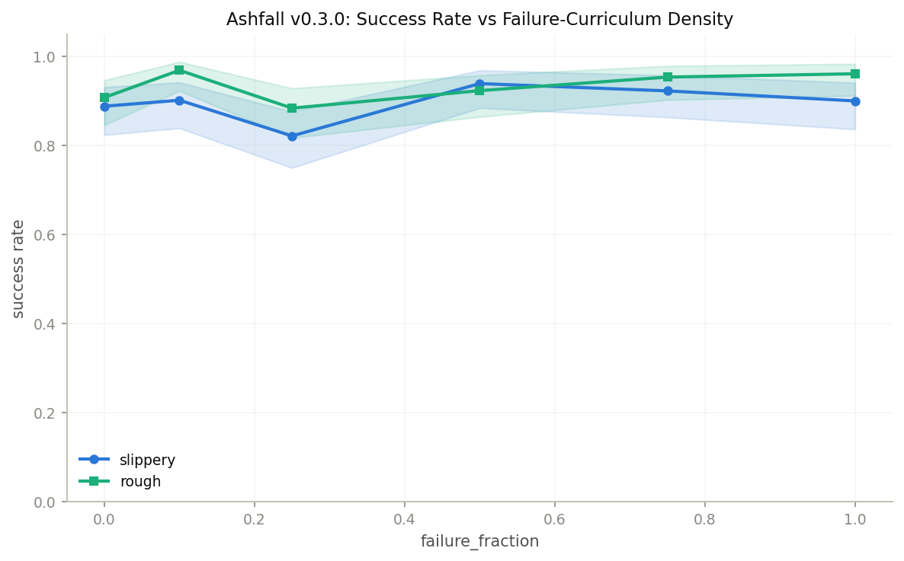
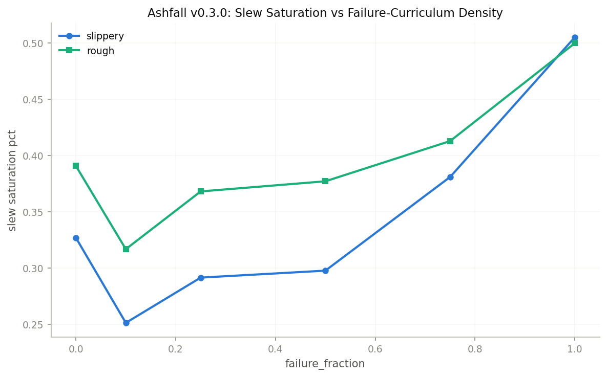
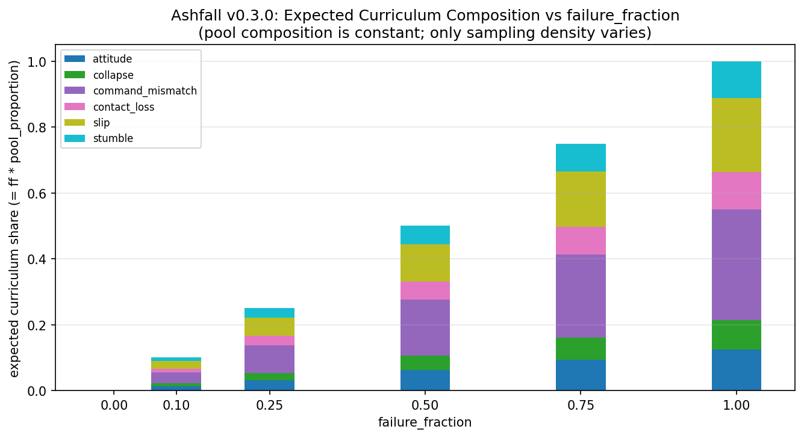

# Ashfall v0.3.0: Failure-Fraction Sweep

Generated: 2026-05-07 13:46
Cells discovered: 6

## Setup

Each cell warm-starts from the v0.2.0 ashfall-baseline checkpoint (500-iter PPO on rough), then fine-tunes for 200 iters on slippery with `failure_sample_fraction` set to the cell value. Failure trajectories are sampled from the synth pool at `/home/yusuf/Projects/ashfall/data/failures/`. Each adapted checkpoint is evaluated with 128 episodes × 32 envs on rough and slippery (flat is skipped because Flat-v0 obs are incompatible with the Rough-v0 trained obs).

## Results

| failure_fraction | slippery success | slippery 95% CI | rough success | rough 95% CI | slip slew sat | rough slew sat |
|---:|---:|:---:|---:|:---:|---:|---:|
| 0.00 | 0.888 | [0.824, 0.931] | 0.908 | [0.846, 0.946] | 0.327 | 0.391 |
| 0.10 | 0.902 | [0.839, 0.942] | 0.969 | [0.922, 0.988] | 0.251 | 0.317 |
| 0.25 | 0.821 | [0.750, 0.876] | 0.884 | [0.817, 0.928] | 0.292 | 0.368 |
| 0.50 | 0.939 | [0.884, 0.969] | 0.923 | [0.864, 0.958] | 0.298 | 0.377 |
| 0.75 | 0.922 | [0.863, 0.957] | 0.953 | [0.902, 0.979] | 0.381 | 0.413 |
| 1.00 | 0.900 | [0.836, 0.941] | 0.961 | [0.912, 0.983] | 0.505 | 0.500 |

**Optimum (slippery): failure_fraction = 0.50** (slippery 0.939 [0.884, 0.969], rough 0.923 [0.864, 0.958]).

## Slippery <-> Rough Pareto

Control (failure_fraction=0.0): slippery 0.888, rough 0.908.
- ff=0.10: slippery +0.013, rough +0.061
- ff=0.25: slippery -0.067, rough -0.024
- ff=0.50: slippery +0.051, rough +0.015
- ff=0.75: slippery +0.034, rough +0.046
- ff=1.00: slippery +0.012, rough +0.053

## Statistical Significance

Each non-control cell tested against the ff=0.0 control on the same terrain. Method: approximate BCa bootstrap (10k resamples, sign-corrected two-sample acceleration term, see evaluation/significance.py) for the 95% CI on the success-rate difference; Fisher's exact two-sided test for the p-value. The CI and p-value come from different procedures and can disagree at the margin. Holm-Bonferroni step-down adjustment across the 5 ff comparisons within each terrain.

### Slippery

| ff   | n   | success | delta vs ff=0.0 | 95% CI            | p (Fisher) | p (Holm) | sig |
|-----:|----:|--------:|----------------:|:------------------|-----------:|---------:|:----|
| 0.00 | 134 | 0.888 | _control_ |  |  |  |  |
| 0.10 | 132 | 0.902 | +0.013 | [-0.062, +0.088] | 0.8422 | 1.0000 | n.s. |
| 0.25 | 140 | 0.821 | -0.067 | [-0.153, +0.014] | 0.1270 | 0.6350 | n.s. |
| 0.50 | 131 | 0.939 | +0.051 | [-0.017, +0.118] | 0.1903 | 0.7612 | n.s. |
| 0.75 | 129 | 0.922 | +0.034 | [-0.041, +0.102] | 0.4032 | 1.0000 | n.s. |
| 1.00 | 130 | 0.900 | +0.012 | [-0.064, +0.086] | 0.8425 | 1.0000 | n.s. |

### Rough

| ff   | n   | success | delta vs ff=0.0 | 95% CI            | p (Fisher) | p (Holm) | sig |
|-----:|----:|--------:|----------------:|:------------------|-----------:|---------:|:----|
| 0.00 | 130 | 0.908 | _control_ |  |  |  |  |
| 0.10 | 128 | 0.969 | +0.061 | [+0.007, +0.115] | 0.0679 | 0.3397 | n.s. |
| 0.25 | 129 | 0.884 | -0.024 | [-0.101, +0.046] | 0.5490 | 1.0000 | n.s. |
| 0.50 | 130 | 0.923 | +0.015 | [-0.054, +0.085] | 0.8242 | 1.0000 | n.s. |
| 0.75 | 129 | 0.953 | +0.046 | [-0.016, +0.107] | 0.2211 | 0.6633 | n.s. |
| 1.00 | 128 | 0.961 | +0.053 | [-0.009, +0.108] | 0.1303 | 0.5213 | n.s. |

Stars: `***` Holm-adjusted p<0.001, `**` p<0.01, `*` p<0.05, `n.s.` not significant after multiple-comparison adjustment.

## Failure-Mode Composition

Phoenix's `evaluate.py` does not retain per-episode failure-mode labels at eval time; only aggregate `success_rate` lands in `metrics_*.json`. The breakdown below is therefore the **curriculum-input pool**: the synthetic failure trajectories available to the fine-tune buffer. Across this sweep the pool is identical for every ff cell; only the per-minibatch sampling fraction differs.

Pool totals: 18 trajectories, 1425 steps, 267 active failure-flagged steps.

| mode             | n_traj | n_steps | n_active_steps | active_share |
|:-----------------|-------:|--------:|---------------:|-------------:|
| attitude         |      3 |     240 |             33 |        0.124 |
| collapse         |      3 |     210 |             24 |        0.090 |
| command_mismatch |      3 |     330 |             90 |        0.337 |
| contact_loss     |      3 |     195 |             30 |        0.112 |
| slip             |      3 |     270 |             60 |        0.225 |
| stumble          |      3 |     180 |             30 |        0.112 |

Reading: the pool is balanced at 3 trajectories per mode but skewed in active-failure-step duration toward `command_mismatch` (0.34 of active steps) and `slip` (0.22). High-severity but short-event modes (`collapse` 0.09, `attitude` 0.12) together account for only ~0.21 of active steps. Any lift the curriculum delivers is therefore disproportionately attributable to the `command_mismatch` and `slip` channels by step-count exposure. Confirming or refuting this is the explicit purpose of the next ablation (mode-subset sweep at fixed ff=0.5).

## Plots

## Notes & Limitations
- **Statistical reading**: under approximate BCa bootstrap + Fisher's exact + Holm-Bonferroni, no individual ff cell is statistically distinct from the ff=0.0 control at alpha=0.05 per terrain. The v0.3.0 point-estimate optimum at ff=0.5 (+5.1 pp slippery) is real but its 95% CI on the difference straddles 0. Treat the optimum as the best-bet starting point for a follow-up ablation, not as a proven win.
- **Single seed**: every cell ran with `training.seed = 42`. All CIs above are within-run binomial; they say nothing about cross-seed variance.
- **No per-episode raw data**: Phoenix `evaluate.py` collapses the rollout to aggregate scalars; there are no per-episode success indicators or failure-mode labels at eval time. Per-mode breakdowns at eval time require re-running with a logger patch and are deferred.
- **n_episodes is approximate**: each cell's eval yields 128 to 140 terminations depending on episode length; `num_episodes` per cell is what we trust for Wilson and bootstrap CIs.
- **Flat eval skipped**: Flat-v0 obs (no height_scan) are incompatible with Rough-v0 trained policies.
- **Next ablation**: holding ff=0.5 fixed, sweep failure-mode subsets to identify which modes carry the lift. Configs and wrapper script live under `configs/ablations/failure_modes/` and `scripts/run_failure_modes_ablation.sh`.