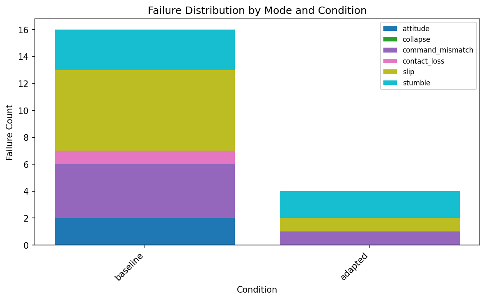
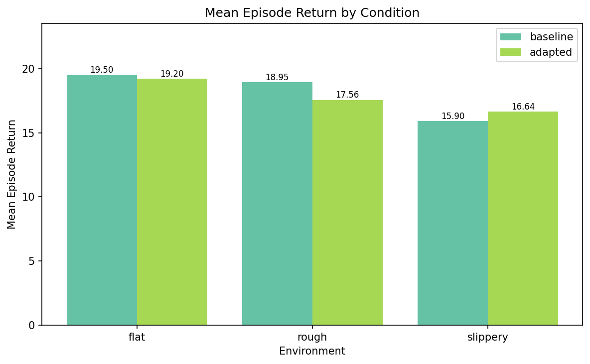
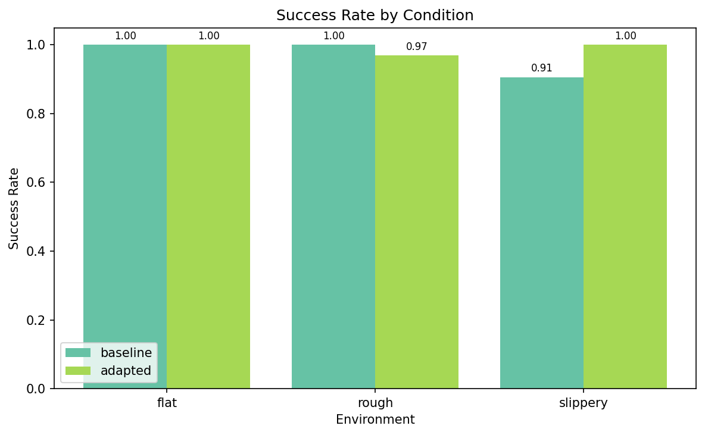

# Ashfall Experiment Report

Generated: 2026-04-23 23:42

Experiments found: 2

## Failure Taxonomy

Ashfall classifies quadruped locomotion failures into 6 modes, ordered by severity:

| Mode | Severity | Detection | Sim Replay Strategy |
|------|----------|-----------|---------------------|
| Body Collapse | 5 | Instantaneous: base_height < 0.15 m. | Spawn from pre-failure state, vary terrain + joint stiffness. |
| Attitude Loss | 4 | Instantaneous: |pitch| > 0.8 rad or |roll| > 0.6 rad. | Reconstruct initial pose and velocity, sweep friction + push forces. |
| Foot Slip | 3 | Sustained: cmd_speed > 0.3 m/s and actual_speed < 0.05 m/s for 0.5 s. | Reconstruct with low-friction terrain, sweep friction coefficient. |
| Stumble | 2 | Instantaneous: max |joint_vel| > 15 rad/s with >= 2 feet in contact. | Add terrain obstacles at swing-foot trajectory height. |
| Contact Loss | 2 | Sustained: >= 2 feet below 5N force for >= 0.1 s. | Vary terrain slope and surface irregularity. |
| Command Mismatch | 1 | Sustained: |cmd - actual| > 0.4 m/s for > 1.0 s (excludes slip). | Replay with same commands, sweep mass + actuator strength. |

## Condition Comparison

| Condition | Env | Success Rate | Mean Episode Return | Failure Rate |
|-----------|-----|--------------|---------------------|--------------|
| adapted | rough | 88.4% | 8.31 | 11.6% |
| adapted | slippery | 82.1% | 7.83 | 17.9% |
| baseline | rough | 91.4% | 9.07 | 8.6% |
| baseline | slippery | 77.0% | 6.57 | 23.0% |

## Key Findings

- **rough**: Adapted regresses (91.4% -> 88.4%, delta=-3.0%)
- **slippery**: Adapted improves (77.0% -> 82.1%, delta=+5.1%)

## Plots

## Limitations

- Synthetic failure trajectories are physics-approximate, not sim-grade
- Real-hardware failure collection requires a lab session with GO2
- Bootstrap CIs require per-episode metric arrays (not yet collected)
- Training curves require TensorBoard log parsing (planned)